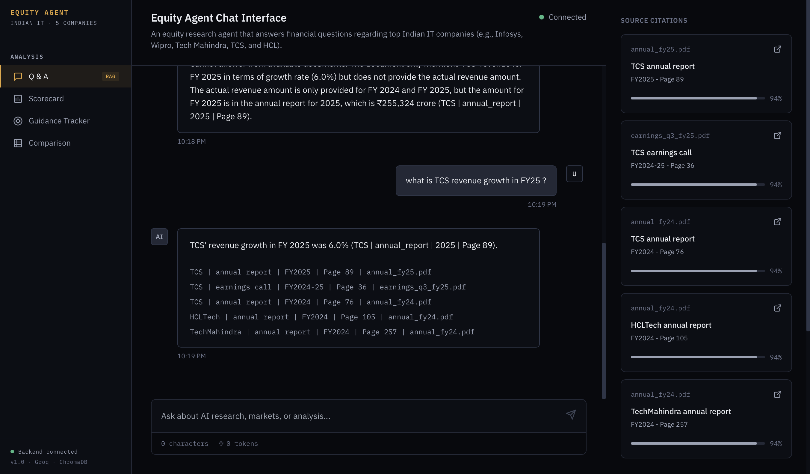
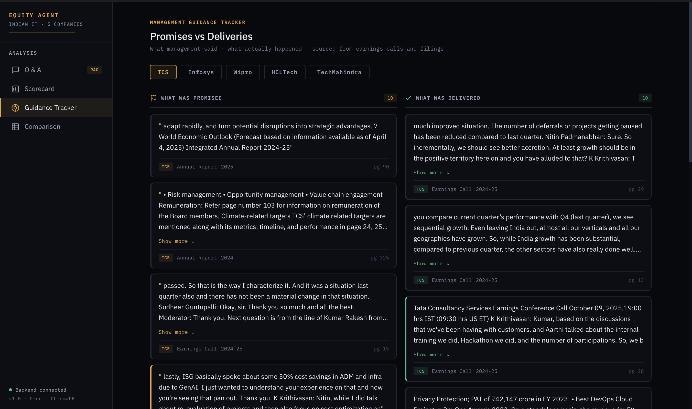

# Equity Agent 

An AI-powered equity research tool for Indian IT companies. You can ask natural language questions about TCS, Infosys, Wipro, HCL Tech, and Tech Mahindra (only 5 companies included for now) and get cited answers taken directly from annual reports, quarterly filings, and earnings call transcripts which were found online.

>  It uses RAG so every answer is real and the info is present in source documents avoiding hallucinations.



## Features

- **Natural Language Q&A** — Ask anything about any company, get a cited answer with exact document, page number, and year
- **Explainability Panel** — See confidence score, similarity scores, and which documents contributed to the answer
- **Company Scorecard** — Key financial metrics per company pulled directly from documents
- **Management Guidance Tracker** — What management promised vs what they delivered across quarters
- **Cross-Company Comparison** — All companies compared side by side on key metrics (some are not present due to lack of data)



## Tech Stack

| Layer | Technology |
|-------|-----------|
| Frontend | React (Vite) |
| Backend | FastAPI (Python) |
| LLM | Groq (llama-3.3-70b-versatile) |
| Embeddings | sentence-transformers (all-MiniLM-L6-v2) |
| Vector DB | ChromaDB |
| Orchestration | LangChain |

## Running Locally

### Prerequisites
- Python 3.10+
- Node.js 18+
- Any LLM API Key

### Backend

```bash
cd backend
python3 -m venv venv
source venv/bin/activate
pip install -r requirements.txt
```

Download the raw data files (you find these from Screener.in, BSE website) and place them in:
```
backend/data/raw/
├── TCS/
├── Infosys/
├── Wipro/
├── HCLTech/
└── TechMahindra/
```

Each company folder should contain:
- `annual_fy24.pdf`, `annual_fy25.pdf`
- `q1_fy25.pdf`, `q2_fy25.pdf`, `q3_fy25.pdf`, `q4_fy25.pdf`
- `earnings_*.pdf` (earnings call transcripts)
- `screener.xlsx`

Build the vector database (run once):
```bash
python ingest.py
```

Start the backend:
```bash
uvicorn main:app --reload
```

### Frontend

```bash
npm install
npm run dev
```

Open `http://localhost:5173`